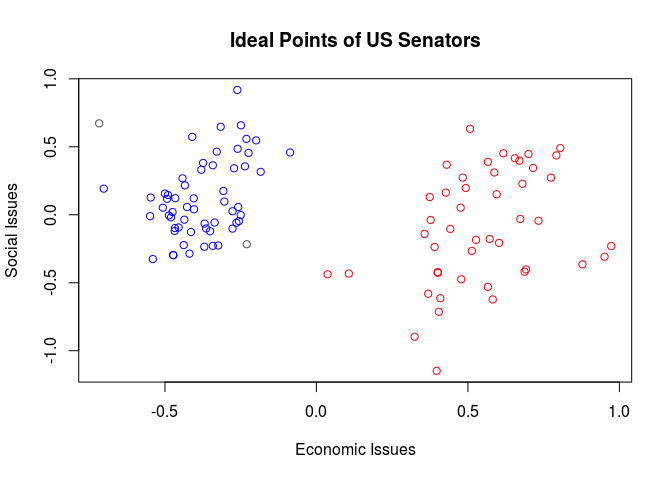

relatable
================

<!-- README.md is generated from README.Rmd. Please edit that file -->

`relatable` provides two easy-to-use, robust functions for mapping from
a vector of keys to a vector of values, as well as creating and applying
more sophisticated mappings, such as many-to-many, one-to-many, and
many-to-one relations. These are primarily designed with two goals in
mind:

1.  Producing reusable code that is easier to write and read.
2.  Ensuring relations conform to specified restrictions, for example
    injectivity or surjectivity, and safely handle nonstandard mappings,
    including unexpected inputs, NAs, heterogeneous lists containing
    multiple variable types including other lists, and mappings between
    vectors of uncertain or unequal lengths.

## Installation

You can install `relatable` from github with:

``` r
# install.packages("devtools")
devtools::install_github("domjarkey/relatable")
```

## Examples

For more detailed information, see the help documentation with `?relate`
and the [Relation Types and
Restrictions](https://github.com/domjarkey/relatable/blob/master/vignettes/restrictions.Rmd)
vignette.

### A simple key-value dictionary

For basic use, `relate` maps a vector of inputs `X` from their position
in a vector of keys `A` to the corresponding value in vector `B`.
`relation` returns a function that performs the same mapping for
repeated usage.

``` r
library(relatable)
# Use relate() for a one-off mapping of inputs from one vector to another
relate(c("March", "April", "May"), month.name, month.abb)
#> [1] "Mar" "Apr" "May"

# Create a reusable dictionary function with relation().
chem_symbol <- relation(elements$Name, elements$Symbol)

chem_symbol(c("Iron", "Lithium", "Sodium"))
#> [1] "Fe" "Li" "Na"

# Unexpected inputs return <NA> by default, but this can be changed
chem_symbol(c("Sodium", "Adamantium"))
#> [1] "Na" NA

# relate() and relation() have optional arguments to determine the type of
# output and default return values.
chem_symbol <- relation(elements$Name, elements$Symbol,
  default = "Unknown", named = TRUE)

chem_symbol(c("Sodium", "Adamantium"))
#>     Sodium Adamantium 
#>       "Na"  "Unknown"
```

### Ensure expected inputs while manipulating larger data sets

When working with unfamiliar data it can be easy to forget to account
for all possible values a variable might take, or worse, typographical
entry errors. Using `allow_default = FALSE`, `relatable` functions can
flag unexpected inputs to ensure these problems don’t arise.

In the following example we use the
[DWNOMINATE](https://voteview.com/about) data set assembled by Poole and
Rosenthal et al, which estimates the ideological positions of US
politicians. Suppose we want to create a new column for our data frame
indicating political party by colour (red for Republicans, blue for
Democrats):

``` r
## Obtain data for senators in the 113th Congress, spanning 2013-2015.
US_senate_113 <- subset(
  foreign::read.dta("ftp://k7moa.com/junkord/SL01113D21_BSSE_12.DTA"),
  cong == 113
)

## Setting allow_default = FALSE ensures we will be notified of any funny inputs.
US_senate_113$colour <- relate(
  X = US_senate_113$party,
  A = c(100, 200),
  B = c("blue", "red"),
  allow_default = FALSE
)
#> Warning in default_behaviour(x): 328 does not have a valid mapping to an
#> element in the codomain.

#> Warning in default_behaviour(x): 328 does not have a valid mapping to an
#> element in the codomain.

## Woops! Looks like we forgot to allow for the two Independent Senators in the data set,
## coded as 328. Let's try again:
US_senate_113$colour <- relate(
  X = US_senate_113$party,
  A = c(100, 200, 328),
  B = c("blue", "red", "gray30"),
  allow_default = FALSE
)

## No warnings, no worries!
with(
  US_senate_113,
  plot(
    x = dwnom1,
    y = dwnom2,
    col = colour,
    main = "Ideal Points of US Senators",
    xlab = "Economic Issues",
    ylab = "Social Issues"
  )
)
```

<!-- -->
